# FlashCache: 700k+ RPS High-Frequency Key-Value Store

  

FlashCache is a single-threaded, event-driven key-value store engineered for **ultra-low latency** and **high throughput**. 

Built from scratch in C++20, it leverages **kernel-bypass concepts (Epoll)** and **custom memory allocation (Arena)** to process over **763,000 requests per second** on a single core—outperforming standard Redis (~100k RPS) by **7x** on local benchmarks.

Whitepaper: [FlashCache Whitepaper](/docs/FlashCache_Whitepaper.pdf)

Benchmark Test: [Video](/docs/benchmark.mp4)

## Performance Benchmarks

**Test Environment:**
- **Hardware:** AMD Ryzen 5 5600H, 16GB RAM
- **OS:** Fedora Linux 42 (Workstation Edition)
- **Tool:** redis-benchmark
- **Configuration:** 50 parallel clients, 100,000 requests per test

### Throughput Performance

| Test Scenario | SET (req/s) | GET (req/s) | Average (req/s) |
|:---|---:|---:|---:|
| **No Pipelining (3B payload)** | 79,618 | 79,745 | **79,682** |
| **Pipelining P=10 (3B payload)** | 787,402 | 751,880 | **769,641** |
| **No Pipelining (256B payload)** | 79,302 | 78,989 | **79,146** |
| **Pipelining P=10 (256B payload)** | 746,269 | 746,269 | **746,269** |

### Latency Distribution (milliseconds)

**Without Pipelining (Optimal Latency):**
| Operation | P50 | P95 | P99 | P99.9 |
|:---|---:|---:|---:|---:|
| **SET** | 0.327 | 0.351 | 0.431 | 0.543 |
| **GET** | 0.327 | 0.351 | 0.399 | 0.463 |

**With Pipelining P=10 (Maximum Throughput):**
| Operation | P50 | P95 | P99 | P99.9 |
|:---|---:|---:|---:|---:|
| **SET** | 0.327 | 0.383 | 0.575 | 1.111 |
| **GET** | 0.335 | 0.463 | 0.503 | 0.663 |


## Core Architecture

```mermaid

%%{init: {
    "theme": "default",
    "themeVariables": {
        "background": "#ffffff",
        "clusterBkg": "#ffffff",
        "clusterBorder": "#343434" ,

        "primaryColor": "#ffffff",
        "primaryColorLight": "#ffffff",
        "primaryColorDark": "#ffffff"
    }
}}%%
flowchart LR
    %% Subgraph: The External World
    subgraph Clients["Phase 1: Clients"]
        CLI["redis-benchmark / redis-cli"]
        SDK["TCP Clients"]
    end

    %% Subgraph: The Engine (Your C++ Code)
    subgraph Engine["FlashCache: Single-Threaded Core"]
       
        %% Networking Layer
        subgraph Net["Network Layer (Zero-Copy)"]
            EPOLL["Epoll Event Loop<br>(Edge Triggered)"]
            READ["Read Buffer<br>(Per-Client Accumulation)"]
            PARSER["RESP Parser<br>(std::string_view)"]
        end
        
        %% Execution Layer
        subgraph Core["Execution Engine (No Locks)"]
            DISPATCH["Command Dispatcher<br>(Pipelined Loop)"]
            LOGIC["SET / GET Logic"]
        end
        
        %% Memory Layer
        subgraph Mem["Memory Management (O(1))"]
            MAP["Hash Map<br>(std::unordered_map)"]
            ARENA["Linear Arena Allocator<br>(Append-Only 64MB)"]
        end
       
        %% Output Layer
        subgraph Out["Write Path"]
            BATCH["Write Batcher<br>(Response Aggregation)"]
        end
    end

    %% Flows
    CLI -- "TCP Packets (Pipeline)" --> EPOLL
    EPOLL -- "Notification" --> READ
    READ -- "Raw Bytes" --> PARSER
    PARSER -- "Tokens (Views)" --> DISPATCH
   
    DISPATCH -- "Execute" --> LOGIC
    LOGIC -- "Read/Write" --> MAP
   
    MAP -- "Store Value" --> ARENA
    ARENA -- "Pointer" --> MAP
   
    LOGIC -- "Response" --> BATCH
    BATCH -- "Single send() syscall" --> Clients

    %% Styling

    classDef client fill:#ffffff,stroke:#0284c7,stroke-width:2px,color:#0f172a
    classDef net fill:#ffffff,stroke:#16a34a,stroke-width:2px,color:#0f172a
    classDef core fill:#ffffff,stroke:#ea580c,stroke-width:2px,color:#0f172a
    classDef mem fill:#ffffff,stroke:#dc2626,stroke-width:2px,color:#0f172a

    class CLI,SDK client
    class EPOLL,READ,PARSER,BATCH net
    class DISPATCH,LOGIC core
    class MAP,ARENA mem


```



### 1. Single-Threaded Event Loop (Epoll)

Instead of thread-per-client (Apache style), FlashCache uses Linux Epoll in Edge-Triggered mode.

- Benefit: Zero context-switching overhead.
- Why: Locks (std::mutex) kill latency. By serializing execution on one core, we keep the CPU instruction cache hot.

### 2. Custom Linear Arena Allocator

Standard malloc is non-deterministic and causes heap fragmentation.

- Solution: A pre-allocated 64MB Arena.
- Mechanism: Allocation is a simple pointer increment.
- Result: Elimination of malloc overhead on the hot path.

### 3. Zero-Copy RESP Parser
Standard parsers copy bytes into std::string objects.

- Solution: A custom parser using std::string_view.
- Benefit: Zero heap allocations during packet processing. We strictly point to the raw read buffer.

## Build and Run

Requirements: Linux, C++20 Compiler (GCC/Clang), CMake.
```bash
#1. Clone
git clone https://github.com/Sudhanshu-S3/FlashCache.git
cd Flash-Cache

# 2. Build (Release Mode for Max Speed)
mkdir build && cd build
cmake -DCMAKE_BUILD_TYPE=Release ..
make

# 3. Run Server
./flash_cache

```

## Testing
Unit tests are implemented using Google Test to ensure reliability of the Arena allocator and Parser logic.

```bash
# Run the test suite
./flash_test
```

## Future Roadmap

- Slab Allocation: Upgrade Arena to allow freeing memory (Bitmap-based reuse).
- Snapshotting: Asynchronous persistence (RDB style) using fork().
- Cluster Mode: Consistent Hashing for horizontal scaling.
