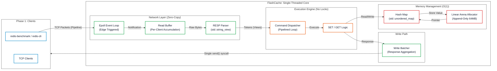

# Distributed-Cache-System

### Architecture Design

```mermaid

%%{init: {
    "theme": "default",
    "themeVariables": {
        "background": "#ffffff",
        "clusterBkg": "#ffffff",
        "clusterBorder": "#343434" ,

        "primaryColor": "#ffffff",
        "primaryColorLight": "#ffffff",
        "primaryColorDark": "#ffffff"
    }
}}%%
flowchart LR
    %% Subgraph: The External World
    subgraph Clients["Phase 1: Clients"]
        CLI["redis-benchmark / redis-cli"]
        SDK["TCP Clients"]
    end

    %% Subgraph: The Engine (Your C++ Code)
    subgraph Engine["FlashCache: Single-Threaded Core"]
       
        %% Networking Layer
        subgraph Net["Network Layer (Zero-Copy)"]
            EPOLL["Epoll Event Loop<br>(Edge Triggered)"]
            READ["Read Buffer<br>(Per-Client Accumulation)"]
            PARSER["RESP Parser<br>(std::string_view)"]
        end
        
        %% Execution Layer
        subgraph Core["Execution Engine (No Locks)"]
            DISPATCH["Command Dispatcher<br>(Pipelined Loop)"]
            LOGIC["SET / GET Logic"]
        end
        
        %% Memory Layer
        subgraph Mem["Memory Management (O(1))"]
            MAP["Hash Map<br>(std::unordered_map)"]
            ARENA["Linear Arena Allocator<br>(Append-Only 64MB)"]
        end
       
        %% Output Layer
        subgraph Out["Write Path"]
            BATCH["Write Batcher<br>(Response Aggregation)"]
        end
    end

    %% Flows
    CLI -- "TCP Packets (Pipeline)" --> EPOLL
    EPOLL -- "Notification" --> READ
    READ -- "Raw Bytes" --> PARSER
    PARSER -- "Tokens (Views)" --> DISPATCH
   
    DISPATCH -- "Execute" --> LOGIC
    LOGIC -- "Read/Write" --> MAP
   
    MAP -- "Store Value" --> ARENA
    ARENA -- "Pointer" --> MAP
   
    LOGIC -- "Response" --> BATCH
    BATCH -- "Single send() syscall" --> Clients

    %% Styling

    classDef client fill:#ffffff,stroke:#0284c7,stroke-width:2px,color:#0f172a
    classDef net fill:#ffffff,stroke:#16a34a,stroke-width:2px,color:#0f172a
    classDef core fill:#ffffff,stroke:#ea580c,stroke-width:2px,color:#0f172a
    classDef mem fill:#ffffff,stroke:#dc2626,stroke-width:2px,color:#0f172a

    class CLI,SDK client
    class EPOLL,READ,PARSER,BATCH net
    class DISPATCH,LOGIC core
    class MAP,ARENA mem


```
